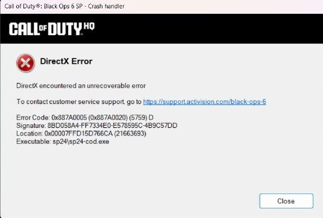
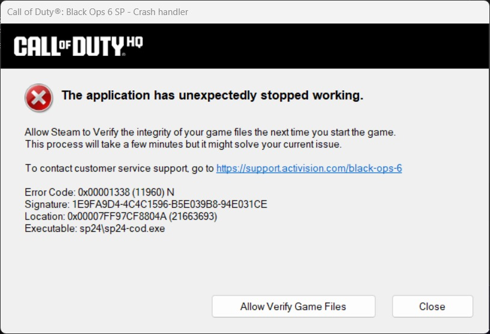

# COD BO6 - DirectX Error Fix Script

Batch script sederhana untuk **memperbaiki error DirectX dan crash** pada *Call of Duty: Black Ops 6 (Crack)*  
seperti pesan:
- `DirectX encountered an unrecoverable error`
- `The application has unexpectedly stopped working`

Spesifikasi Laptop :
- **Intel i5-12500H**
- **RTX 3050 Laptop GPU (4 GB)**
- **RAM 8 GB**
- **SSD storage**
- **Windows 11 + DirectX 12**

---

## Fitur Script
| Langkah | Fungsi |
|----------|---------|
| 1 | Menghapus cache `Activision\Call Of Duty` di `%LOCALAPPDATA%` untuk mencegah konflik konfigurasi. |
| 2 | Membersihkan `NVIDIA\DXCache` (DirectX shader cache) agar GPU tidak memuat data lama. |
| 3 | Melakukan *DirectX prewarm* melalui PowerShell (WPF Viewport3D) untuk menyalakan GPU context sebelum game dibuka. |
| 4 | Menjalankan launcher original `[KLIK INI UNTUK BERMAIN].bat` dengan prioritas tinggi. |

---

## Cara Penggunaan
1. Letakkan file `launch_bo6_clean_and_play.bat` **di folder game** (satu folder dengan `[KLIK INI UNTUK BERMAIN].bat`, atau dengan file yang ada .bat yang wajib lewat file tersebut).
2. Klik kanan → **Run as administrator**.
3. Tunggu 3–5 detik sampai proses pembersihan dan GPU inisialisasi selesai.
4. Game akan otomatis dijalankan.

---

## Catatan Tambahan
Jika error **masih muncul setelah menjalankan script**, pastikan hal berikut sudah dilakukan:

1. **Update DirectX** ke versi terbaru:  
   - [Download DirectX Runtime Web Installer](https://download.microsoft.com/download/1/7/1/1718ccc4-6315-4d8e-9543-8e28a4e18c4c/dxwebsetup.exe)

2. **Install Microsoft Visual C++ Redistributable (resmi dari Microsoft):**  
   - [x86 (32-bit)](https://aka.ms/vs/17/release/vc_redist.x86.exe)  
   - [x64 (64-bit)](https://aka.ms/vs/17/release/vc_redist.x64.exe)

3. **Update Windows** ke versi terbaru agar driver WDDM & DirectX kompatibel.

---

## Lisensi
Script ini bersifat **open source** dan bebas digunakan untuk keperluan pribadi atau perbaikan sistem.  
Tidak berafiliasi dengan Activision, Blizzard, atau Treyarch.

---

**Author:** [misuminitt](https://github.com/misuminitt)
